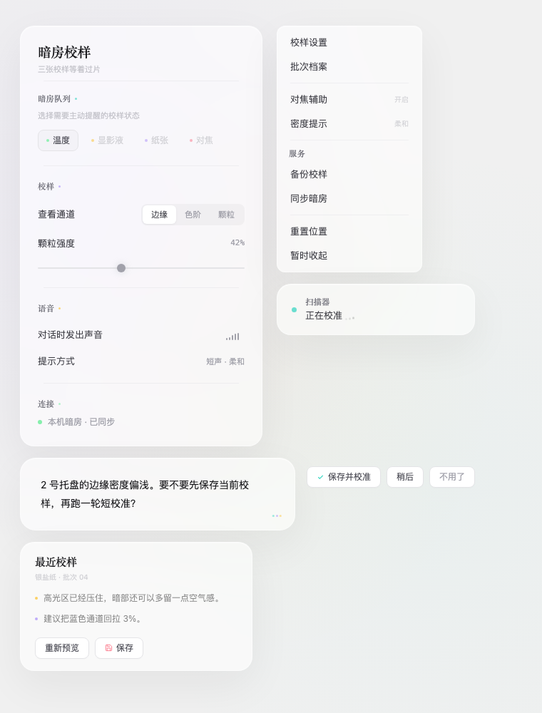

# Rizum Glass

Rizum Glass is a reusable UI design language for compact software surfaces. It combines neutral liquid glass, paper-like editorial rhythm, restrained pointillist color, and tactile Apple/Arc-inspired motion.

The visual language is reusable across products. The canonical design environment is intentionally specific: **React + TypeScript + Vite + Tailwind CSS + shadcn/ui**. Final products may optionally use the GPUI adapter after the web reference is approved; GPUI is not required.



## Repository Map

| Path | Role |
| --- | --- |
| [`DESIGN.md`](DESIGN.md) | Canonical machine-readable and human-readable design specification. |
| [`docs/design-rationale.md`](docs/design-rationale.md) | The taste, priorities, and reasoning behind the rules. |
| [`docs/implementation.md`](docs/implementation.md) | Adoption, validation, and synchronization workflow. |
| [`tokens/`](tokens/) | Generated Tailwind v4 and DTCG token exports. |
| [`adapters/gpui/`](adapters/gpui/) | Optional generated GPUI theme, Rust tokens, translation contract, and component gallery. |
| [`skills/rizum-glass/`](skills/rizum-glass/) | Reusable Codex skill for web-first design and optional GPUI translation. |
| [`examples/transfer-test-darkroom-v12.html`](examples/transfer-test-darkroom-v12.html) | An unrelated product-domain test generated from the design language. |
| [`references/`](references/) | Product-specific snapshots used as visual evidence, never as the source of truth. |

## Use In A Project

For an active project, add this repository as a submodule so improvements can be pulled without copying documents by hand:

```bash
git submodule add https://github.com/Rizumu85/rizum-glass.git design/rizum-glass
```

Then tell coding agents and contributors:

```text
Read design/rizum-glass/DESIGN.md before making UI or UX changes.
Treat it as the source of truth. Do not infer rules from reference HTML.
```

For a self-contained snapshot instead, clone this repository and run:

```bash
./scripts/sync-design.sh /absolute/path/to/project/DESIGN.md
```

See [`docs/implementation.md`](docs/implementation.md) for the full workflow.

## Install The Skill

Install the repository-owned skill as a live link so improvements made here are immediately available to new projects:

```bash
./scripts/install-skill.sh
```

Then invoke it explicitly when useful:

```text
Use $rizum-glass to design this interface.
```

The skill defaults to the web reference stack. It enters GPUI translation mode only when the consuming project explicitly chooses GPUI.

## Optional GPUI Delivery

Do not design the native version from scratch. First approve a working web reference, capture its dimensions, states, tokens, and motion in a reference contract, then translate it with `gpui-component` and the generated adapter assets:

```bash
./scripts/export-tokens.sh
cd adapters/gpui/gallery
cargo run
```

See [`adapters/gpui/README.md`](adapters/gpui/README.md) for the translation boundary.

## Evolving The Style

1. Change `DESIGN.md` first.
2. Run `./scripts/export-tokens.sh` to regenerate web tokens, GPUI assets, and the skill snapshot.
3. Record the intent in `CHANGELOG.md`.
4. Generate a new interface in an unrelated product domain using only `DESIGN.md`.
5. Compare the result against the design principles, not against a product screenshot pixel for pixel.
6. Add a new versioned example or reference file instead of overwriting history.
7. Pull the update into consuming projects through the submodule or sync script. A locally linked Skill updates with the repository automatically.

## Status

Version 1.0 was extracted from the long-running Nolnol prototype process. Product concepts remain in `references/`; reusable visual and interaction decisions live in `DESIGN.md`.
